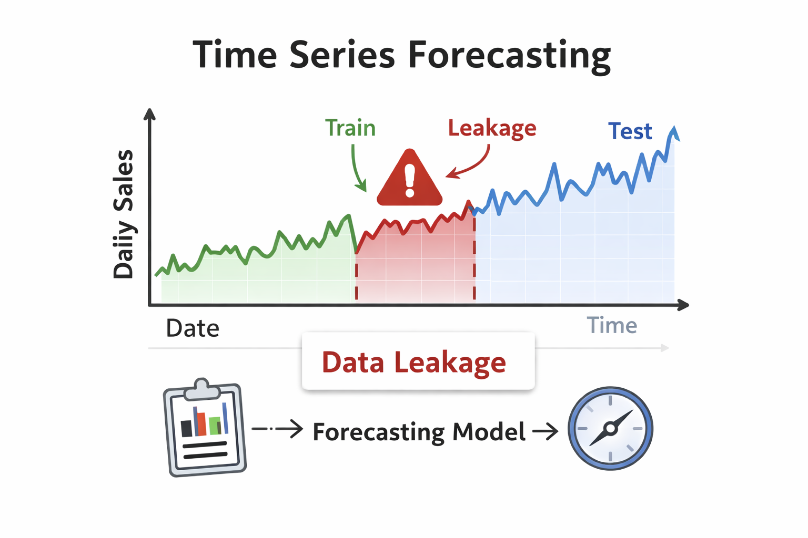

# Fixing Data Leakage in Time Series Forecasting

## Overview

Many forecasting models "look amazing" on paper… because the evaluation is accidentally **leaking future information** into training.
This problem tests your ability to reason about **proper experimental design** in time-series ML.

## The Problem

You are given a dataset of daily sales:
- `date`
- `sales`
- optional exogenous features: `price`, `promotion`, `holiday`, `weather`

A team trains a model and claims **very low error**.
But you suspect the pipeline has **data leakage** and **invalid evaluation**.

Common symptoms:
- Random train/test split on time series
- Feature scaling / imputation done on the full dataset before splitting
- Using future-target information indirectly (rolling features computed incorrectly)
- Tuning hyperparameters using the test set

## Your Task

1. **Identify Leakage Risks**
   - List the most likely leakage points in a typical time-series ML pipeline (at least 5).
   - For each one, explain *why* it leaks and *how it inflates performance*.

2. **Propose a Correct Evaluation Protocol**
   - Describe a proper time-series validation strategy (e.g., rolling/expanding window backtesting).
   - Explain where feature engineering, scaling, imputation, and hyperparameter tuning should happen.

3. **Robustness Improvements (Bonus)**
   - Propose 2–3 practical improvements to make the model more reliable in real deployment
     (concept drift monitoring, retraining schedule, baseline comparisons, etc.)

## Optional: Pseudo-Code

You may include pseudo-code to sketch:
- how to generate rolling splits
- how to fit preprocessors only on training folds
- how to evaluate and aggregate metrics across folds

## What to Submit

- A short, clear explanation answering the tasks above.
- Optional pseudo-code.

## Evaluation

Submissions are judged on:
1. **Clarity** – How clearly you explain leakage and correct evaluation.
2. **Correctness** – Whether your protocol is actually leak-free.
3. **Practicality** – Whether it’s realistic to implement in a real ML workflow.
4. **Insight** – Strong reasoning about deployment reliability.